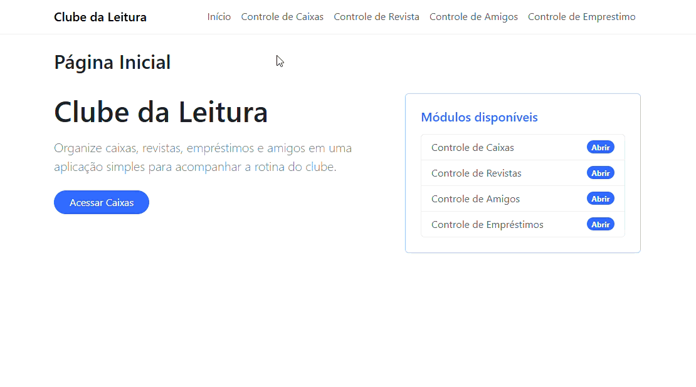

# 📚 Clube da Leitura



## 1. Introdução
O *Clube da Leitura* é uma aplicação desenvolvida para organizar e controlar o empréstimo de revistas em quadrinhos.  
Gustavo, dono de uma grande coleção, decidiu compartilhar suas revistas com amigos. Para evitar perdas e manter o controle, foi criada esta aplicação que gerencia *caixas, revistas, amigos e empréstimos*.

O sistema foi desenvolvido em *.NET 10.0 SDK*, com foco em simplicidade e eficiência.

---

## 2. Funcionalidades

### 🔹 Módulo de Caixas
- Cadastrar novas caixas
- Editar caixas existentes
- Excluir caixas (se não houver revistas vinculadas)
- Visualizar todas as caixas

*Regras de negócio:*
- Etiqueta única (máx. 50 caracteres)
- Cor obrigatória (paleta ou hexadecimal)
- Dias de empréstimo (padrão: 7)
- Não permitir etiquetas duplicadas
- Cada caixa define prazo máximo de empréstimo

---

### 🔹 Módulo de Revistas
- Cadastrar novas revistas
- Editar revistas existentes
- Excluir revistas
- Visualizar todas as revistas

*Regras de negócio:*
- Título (2–100 caracteres)
- Número da edição (positivo)
- Ano de publicação válido
- Caixa obrigatória
- Não permitir duplicidade de título + edição

---

### 🔹 Módulo de Amigos
- Inserir novos amigos
- Editar amigos cadastrados
- Excluir amigos (se não houver empréstimos vinculados)
- Visualizar lista de amigos

*Regras de negócio:*
- Nome (3–100 caracteres)
- Nome do responsável (3–100 caracteres)
- Telefone válido (10–11 dígitos)
- Não permitir duplicidade de nome + telefone

---

### 🔹 Módulo de Empréstimos
- Registrar novos empréstimos
- Registrar devoluções
- Visualizar empréstimos abertos e concluídos

*Regras de negócio:*
- Campos obrigatórios: Amigo, Revista disponível, Data de empréstimo (automática), Data de devolução (calculada conforme caixa)
- Status: Aberto / Concluído / Atrasado
- Cada amigo só pode ter um empréstimo ativo
- Empréstimos atrasados destacados visualmente
- Data de devolução = Data empréstimo + dias da caixa

---

## 3. Como utilizar

1. Clone o repositório ou baixe o código fonte.
2. Abra o terminal e navegue até a pasta raiz.
3. Restaure as dependências:

   ```bash
   dotnet restore
   ```

4. Para executar o projeto compilando em tempo real

    ```bash
    dotnet run --project ClubeDaLeituraWeb.WebApp
    ```

## Requisitos

- .NET 10.0 SDK
